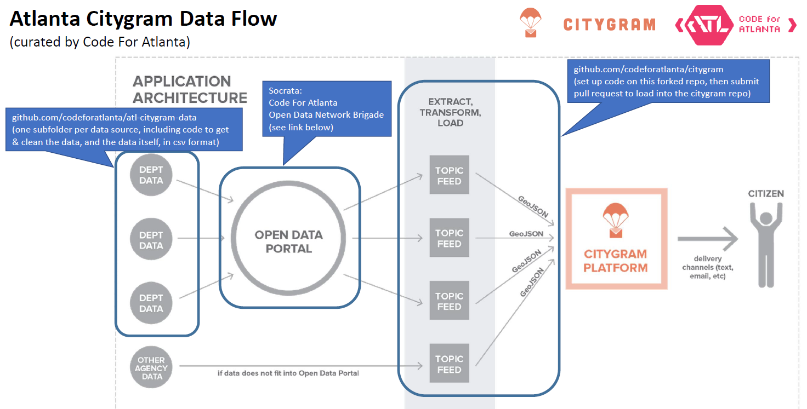

# atl-citygram-data
Scraping &amp; Collecting data to plug in to the Atlanta Citygram app

This is a place to store scraping/cleaning code and the scraped data.  See the diagram below showing the overall data flow.

These first couple datasets will serve as a proof-of-concept for the citygram app in Atlanta.  The goal is to show the value of this app to residents and government agencies, and drive excitement for opening other datasets on the web, so we can plug them in.

